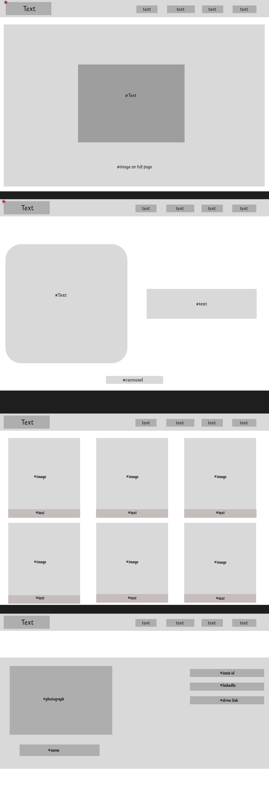

# kiki3016.github.io
# Personal Portfolio – CMPT 276 Mini Project

This is my personal portfolio website built for the CMPT 276 mini project. It showcases my graphic design projects, photography work, and links to my professional profiles.

## 🔧 Technologies Used
- HTML
- CSS
- JavaScript

## 🌐 Live Website
[Click here to view the site](https://kiki3016.github.io/)

## 📄 License  
This project is licensed under the MIT License.  
I chose the MIT License because it allows others to freely use, modify, and share my code for personal or academic purposes, as long as they give credit. This supports open collaboration while maintaining author recognition.

## 🧠 AI Use Declaration
Portions of this website (HTML/CSS styling guidance, layout planning, and accessibility polish) were assisted by ChatGPT under the guidance of CMPT 276’s AI usage policy.

[AI Declaration Form](Miniproject_AI_Declaration_Jaskirat_Kaur_301638761.pdf)

## 🎯 Project Motivation
This site was created to represent my creative and technical work through a single professional portfolio. It also allowed me to practice version control, HTML/CSS structure, and GitHub Pages deployment for CMPT 276.

## 🧪 How to View the Website
1. Visit the deployed site: [https://kiki3016.github.io/](https://kiki3016.github.io/)
2. Explore the navigation bar to view:
   - About section
   - Projects section
   - Photography grid
   - Contact info & social links
3. Check the footer and favicon across pages

## 🖼️Storyboarding/Wireframe

